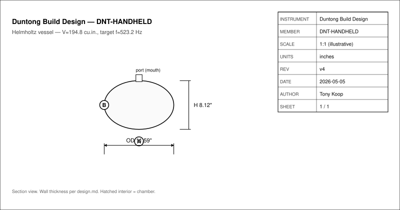
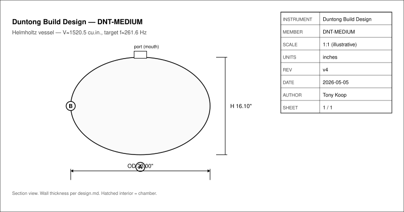
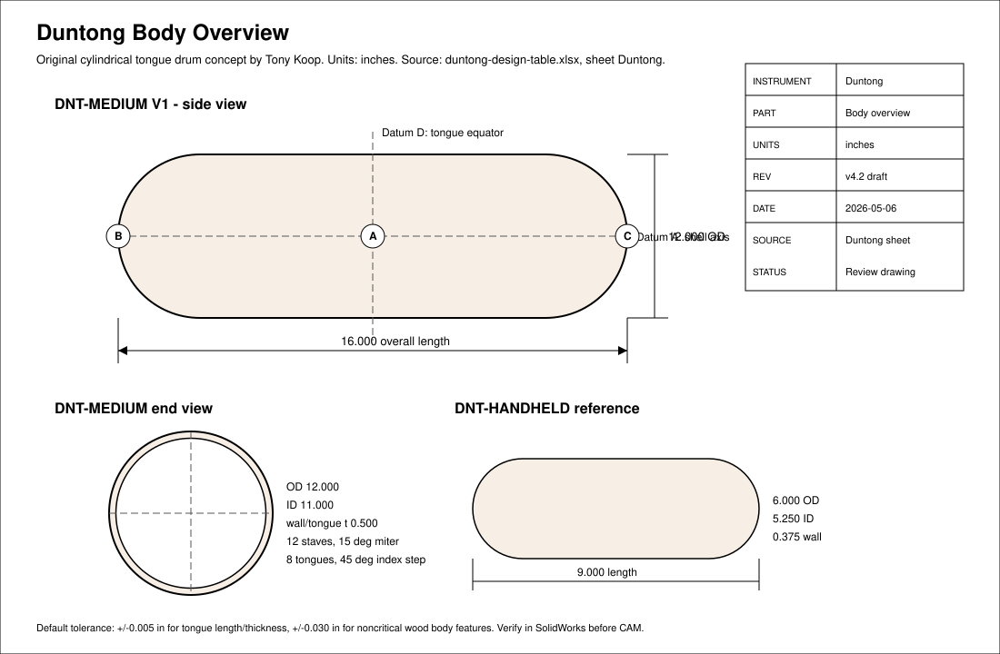
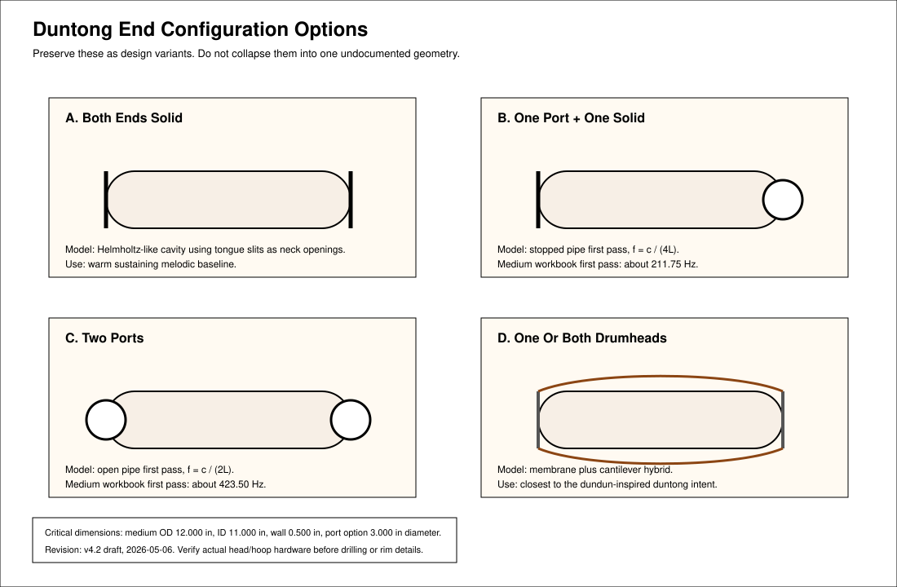

# Duntong Original Cylindrical Tongue Drum
- Musical instrument documentation capstone
- Build packet: duntong
- Generated: 2026-05-05

---

# Project Intent
- The duntong is Tony Koop's original cylindrical tongue drum concept. It combines a dundun-like round body and optional drumhead/ported ends with wooden tongue drum voices cut directly into the shell wall.

_Speaker notes:_ Read design.md before committing to dimensions or sourcing decisions.

---

# Physics Model
- ### Tongues

```
f = K * t / L^2
L = sqrt(K * t / f)
```

```
OD = 12.000 in
length = 16.000 in
wall/tongue thickness = 0.500 in
tongue width = 1.500 in
slit width = 0.125 in
K = 24438
root MIDI = 60 (C4)
```

```
L = sqrt(24438 * 0.5 / 261.63) = 6.834 in
```

```
slit area = 8 * (0.125 * 1.5 + 2 * 0.125 * 3.0) = 7.5 in^2
internal volume = pi * (11 / 2)^2 * 16 = 1520.5 in^3
effective neck length = 0.5 in
f_H = 13552 / (2*pi) * sqrt(7.5 / (1520.5 * 0.5)) = about 214 Hz
```

_Speaker notes:_ Governing equations extracted verbatim from design.md. Apply empirical corrections (NAF K2, scale offsets) only where the model permits — see references/acoustic-models.md.

---

# Hardware Alignment
- The V1 build is a stave-cylinder shell with CNC-cut tongue slits. The CNC plan is pre-CAM only; feeds, speeds, hold-down, and simulation must be set at the actual machine.

| Operation | Tooling | Fixture / datum | Notes |
| --- | --- | --- | --- |
| Rip staves | Table saw, miter sled | Long edge datum, 15 deg miter for 12 staves | Cut extra staves for tuning and destructive tests |
| Thickness staves | Planer / drum sander | Outside face A | Tongue pitch depends directly on final wall thickness |
| Glue cylinder | Band clamps or hose clamps | Shell axis datum A | Glue in two half-shells, then join halves |
| True shell | Lathe | Shell axis between centers/chuck | Final wall is tuning-critical |
| End cap or drumhead prep | Lathe, band saw, drill press | End plane datum B/C | Preserve sealed, ported, and drumhead variants |
| Tongue layout | 1:1 wrap template or SolidWorks unwrap | Shell axis A, equator plane D, index zero E | Single ring around equator for V1 |
| Tongue cuts | CNC router, 1/8 in upcut spiral | V-block cradle, rotary indexing, shell axis A | Start tongues about 5 percent long/flat for tuning trim |
| Tuning | Files, Dremel, tuner | Tongue root and tip marks | Shorten tip to raise pitch; thin near base to lower pitch |

_Speaker notes:_ Identifies which shop pipeline(s) this instrument lives in: Bambu+kiln slip-cast, 40W laser flat-pack, CNC+lathe, segmented turning, drum-skin work, or hybrid combinations.

---

# How To Use This Packet
- Start with design.md for intent and assumptions.
- Use bom.csv, sourcing.csv, and cut-list.csv before buying or cutting.
- Use drawing-brief.md and CAD/CNC folders before machining.
- Print the packet for shopping, shop work, and validation.

---

# File Map
- design.md: Project intent, catalog metadata, assumptions, and validation plan.
- bom.csv: Starter bill of materials with part categories, quantities, drawing refs, and notes.
- sourcing.csv: Supplier/search tracker with specs, price/date fields, lead time, substitutes, and risks.
- cut-list.csv: Rough/final stock sizes, material, grain/orientation, operations, yield, and offcuts.
- drawing-brief.md: Manufacturing drawing and technical product sketch brief.
- assembly-manual.md: Shop-facing sequence, tools, fixtures, safety, tuning, finishing, and maintenance notes.
- validation.csv: Target/measured values, tolerance, environment, result, and tuning/build action log.
- supplier-rfq.md: Supplier email/request-for-quote starter.

---

# Family Spec

| member_id | target_hz | target_note | scale_label | predicted_length_in | predicted_width_in | predicted_height_in | predicted_volume_cuin | wood_species | k_constant | k2_correction | outer_diameter_in | inner_diameter_in | wall_thickness_in | tongue_count | slit_width_in | construction_method | notes |
| --- | --- | --- | --- | --- | --- | --- | --- | --- | --- | --- | --- | --- | --- | --- | --- | --- | --- |
| DNT-HANDHELD | 523.25 | C5 | C minor pentatonic | 9.000 | 6.000 | 6.000 | 194.83 | Padauk | 24438 | 0 | 6.000 | 5.250 | 0.375 | 8 | 0.125 | split-blank or stave | Handheld proof of concept; workbook root MIDI 72 |
| DNT-MEDIUM | 261.63 | C4 | C minor pentatonic | 16.000 | 12.000 | 12.000 | 1520.53 | Padauk | 24438 | 0 | 12.000 | 11.000 | 0.500 | 8 | 0.125 | stave cylinder | V1 build target; medium floor/table instrument |

_Speaker notes:_ Sizes scale via the master scale factor; tuning targets are first-order Helmholtz/cantilever predictions to be empirically corrected per prototype.

---

# Build Workflow
- Design and assumptions
- Source materials and hardware
- Prepare stock, fixtures, and CNC/laser/lathe setup
- Assemble, tune, finish, and validate

---

# Sourcing And BOM
- BOM gives part categories and drawing references.
- Sourcing tracks search terms, supplier candidates, price/date, lead time, substitutions.
- Visual BOM brief turns the parts list into a presentation-ready image board.

---

# Shop Packet
- Cut list for lumber/sheet/blank planning.
- Assembly manual for away-from-keyboard work.
- Validation sheet for measured dimensions, tuning, pass/fail checks.

---

# Drawings, CAD, CNC
- drawing-brief.md defines required views, dimensions, datums, sketch intent.
- cad/ holds models and design tables.
- cnc/ holds CAM, toolpaths, setup sheets, dry-run notes.
- drawings/ holds PDFs, SVGs, DXFs, drawing exports.






---

# Images And Screenshots
- Add hero render/photo, visual BOM, shop screenshots, drawing previews, validation photos in images/.

---

# Validation Plan
- A4 = 440 Hz reference check.
- Tuning targets logged in validation.csv.
- Critical dimensions verified against design sheet and CAD.
- Photos and revision notes after each major step.

---

# Open Risks / Decisions
- TBDs in design sheet and BOM.
- Supplier price/availability not yet verified.
- Generated images marked as concept placeholders.
- Empirical corrections await measured prototype data.

---

# Next Actions
- Replace TBDs with measured/source-backed values.
- Verify live supplier price and availability before buying.
- Export final drawings and visual BOM images.
- Regenerate this deck and print packet after final edits.

---
